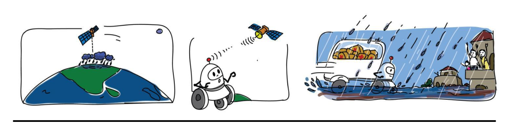

# e-Yantra-Robotics-Competition
e-Yantra Robotics Competition (eYRC) is a competition organised by IIT,Bombay for undergraduate students in science and colleges.
e-Yantra is a project sponsored by MHRD, Government of India, under the National Mission on Education through ICT (NMEICT)

## Theme: Supply Bot
##### The theme of the project is Flood Disaster Management using a “Supply Bot”.
The idea is to build a robot to provide relief aid to the affected district or cities. The relief aid to be received by the affected areas is communicated wirelessly to the robot using a camera. Once the robot has
identified the affected area, moving the relief aid as close as possible to the affected district or city is the primary task of the Supply Bot.

The challenges in the theme include: designing and building a robot with basic components given,
Python Programming, Image Processing, Embedded C Programming.

### Task Description

##### Stage-1
* Task-0:
The aim of this task was to setup the team for further tasks in the competition. This task specifically included installing Python and relevant libraries and get
comfortable with basics of image/video processing in Python.

* Task-1:
Task 1 was a purely software based programming task. This task specifically included image processing problems in order to build upon the concepts and basics of image processing.

* Task-2:
This task involved printing the flex and setting up the Arena for Theme Implementation

All the teams who qualified the stage-1 received robotics kit by IIT,Bombay

##### Stage-2
* Hardware Testing:
The aim of this theme was to test the hardware components that we received for implementation.

* Task-3:
The aim of this task was to get you started with implementing the concepts learnt in Stage 1, using the hardware components received in the kit as per the Rule book.

* Task-4:
The aim of this task was to build the robot and submit the working video of the same.

* Task-5:
This was the final task and its aim was to get the maximum score. The team whose robot completed the tasks in minimum time and minimum penality got maximum score.

